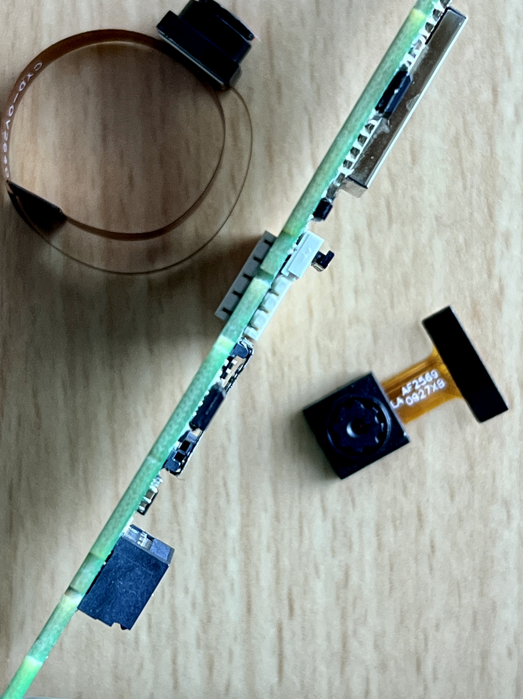
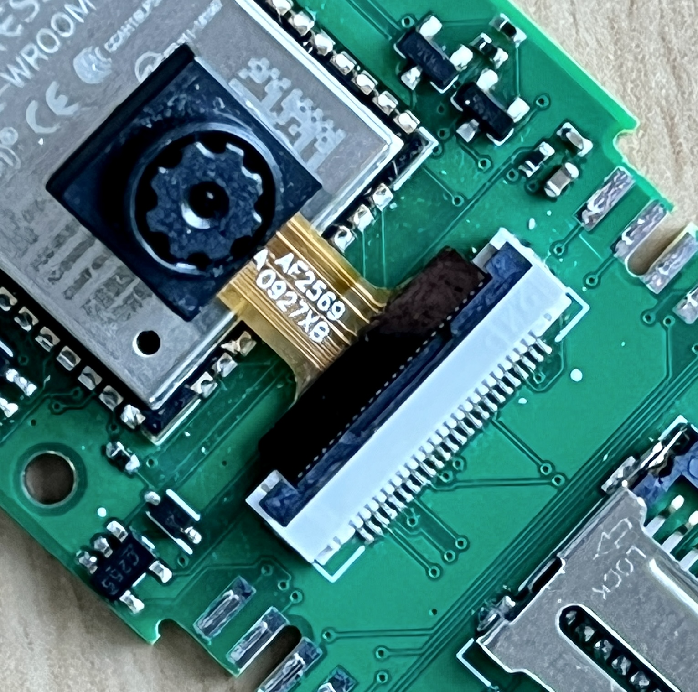
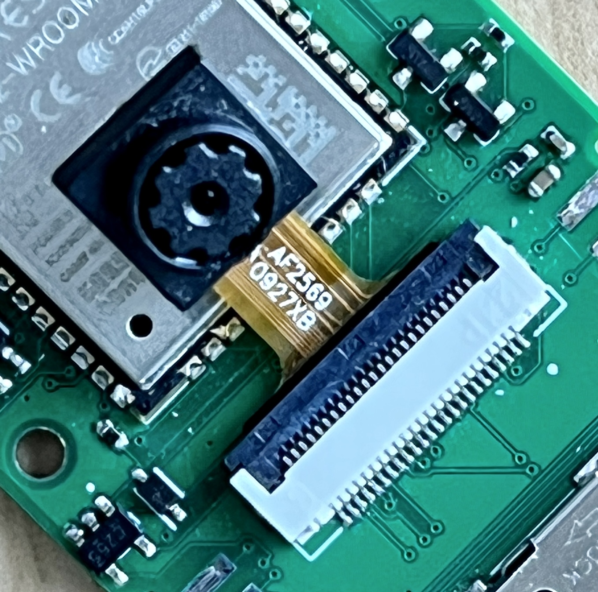
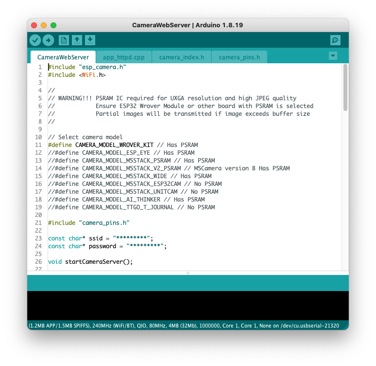
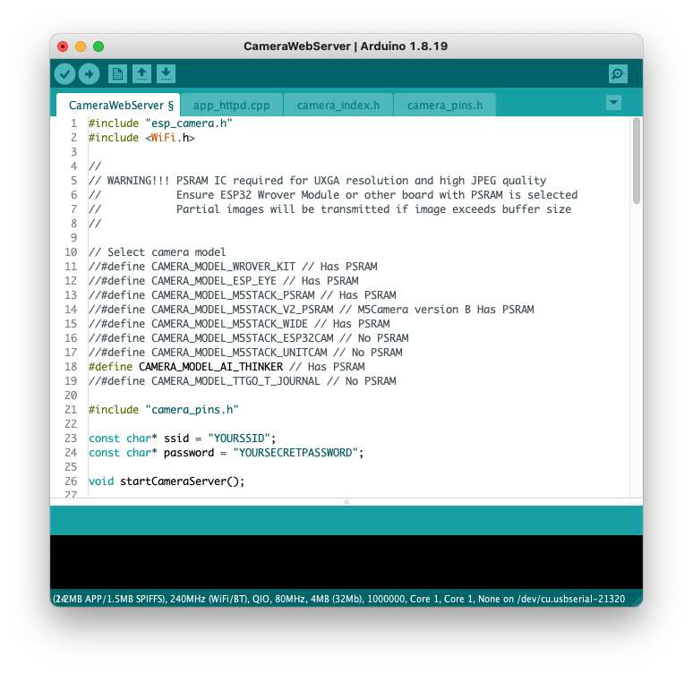

# Using the Camera on The Extended Core (CWV)
Instead of listing a complete example here, you will find the changes below to the existing Camera Example in Arduino already. This way when the Camera Example is updated, this example will not be outdated. It also very specifically show what is different from the existing example.

## The Arduino Example
- Insert a compatible camera.[^cam]
- Open the Example: File :point_right: Examples :point_right: ESP32 (Under `Examples for ESP32`...) :point_right: Camera :point_right: CameraWebServer
- Find this line `#define CAMERA_MODEL_WROVER_KIT // Has PSRAM` and comment it out.
- Find this line `//#define CAMERA_MODEL_AI_THINKER // Has PSRAM` and uncomment it. [^pins]
- Find this line `const char* ssid = "*********";`  and change the asterisks to your WiFi SSID.
- Find this line `const char* password = "*********";` and change the asterisks to your WiFi password.
- Upload!
- Turn on your serial monitor and you  will see something like this
```
.......
WiFi connected
Camera Ready! Use 'http://192.168.4.154' to connect
```
- Copy and paste the link, in this example `http://192.168.4.154` to your browser
- You should see something like this
- Set an appropriate image size and click on `start streaming`
- And you should see what your camera sees

## Illustrations
### Insert the camera
Open the camera connector by lifting the black bar up so it is 90º to its original position


Slide the camera cable into the connector with the *gold fingers* facing down and the black bar facing up.


Close the camera connector 


### Code Before


### Code After


[^cam]: The most wellknown camera used here is the OV2640. Here is a pair on [Amazon](https://www.amazon.com/dp/B097SZBV7N) for ~$9. I prefer the ones with a longer flat cable allowing me to position it without restricting the setup of the electronics, such as [this one](https://www.amazon.com/dp/B08XLWLGG6), but shop around
[^pins]: The Extended Core uses the same pins for the camera as the ESP32-CAM from Ai-Thinker. You can see the exact pins in the [CWV GitHub Repo](https://github.com/domino4com/CWV#camera)
